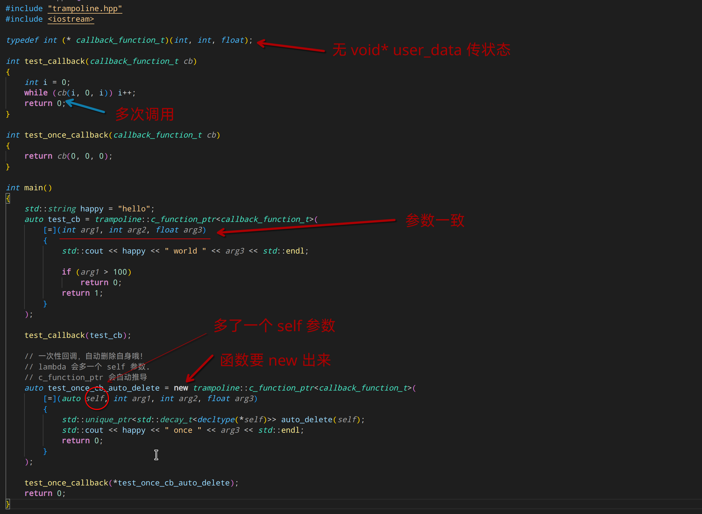

# 为 C 接口的回调增加 lambda 支持。甚至它不需要 `void *user_data` 参数！



# 支持的平台

目前支持的平台为  x86_64/x86/arm64

# 如何添加到项目

如果你的项目是 CMake 管理的，那么很 easy。 使用 git submodule 将 trampoline 添加到 third_party 文件夹

```shell
git submodule add https://github.com/microcai/trampoline.git thrird_party/trampoline
```

然后在 CMakeLists.txt 文件里添加

```cmake
add_subdirectory(thrird_party/trampoline EXCLUDE_FROM_ALL)
```

最后，在使用到 trampoline 的地方，添加链接库

```cmake
target_link_libraries(your_project_what_evertarget trampoline)
```

然后就可以在 你的 cpp 文件里，使用

```c++
#include "trampoline.hpp"
```

然后就可以如 示例里的用法那样开始使用啦！

# add lambda support for C style callback that does not even have `void* user_data` parameter.

see [test2.cpp](test/test2/test2.cpp) for example

# how to use

For cmake based project, it's super easy.
use git submodule to add trampoline

```shell
git submodule add https://github.com/microcai/trampoline.git thrird_party/trampoline
```

then add below line to CMakeLists.txt

```cmake
add_subdirectory(thrird_party/trampoline EXCLUDE_FROM_ALL)
```

finally, link to libtrampoline

```cmake
target_link_libraries(your_project_what_evertarget trampoline)
```

Done！ using it just like above examples!
